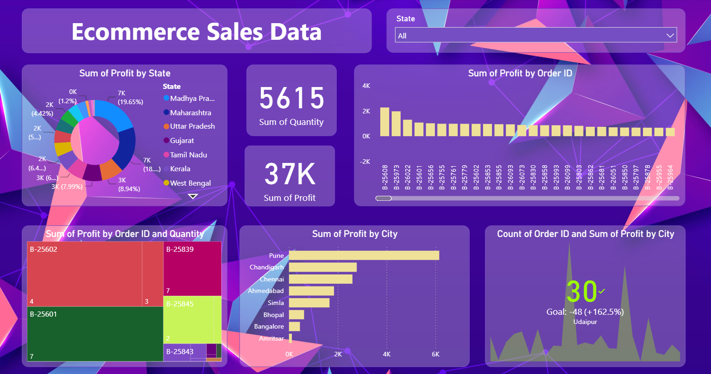

Ecommerce Sales Data Dashboard

This project presents an interactive Ecommerce Sales Dashboard built using Power BI, designed to analyze sales performance across different states, cities, orders, and quantities.
The dashboard helps stakeholders quickly understand profit distribution, top-performing regions, and order-level insights.
***
Project Overview

The dashboard provides insights into:
Total Quantity Sold
Total Profit
Profit distribution by State
Profit by City
Profit by Order ID
Order count vs profit comparison by city
Interactive filtering using State slicer
***
Key Metrics

Total Quantity Sold: 5,615
Total Profit: 37K
Top Profitable City: Pune
Dynamic Filtering: State-wise analysis
***
Dashboard Preview

Below is a preview of the Ecommerce Sales Dashboard:

***
Visualizations Included

Donut Chart: Sum of Profit by State
Bar Chart: Sum of Profit by Order ID
Horizontal Bar Chart: Sum of Profit by City
KPI Cards: Quantity & Profit
Pie Chart: Profit by Order ID and Quantity
Area Chart: Count of Order ID vs Profit by City
***
Tools & Technologies

Power BI
DAX (for measures)
Excel / CSV Dataset
Data Cleaning & Modeling
***
Use Cases

Sales performance analysis
Regional profit comparison
Business decision support
Academic and portfolio projects
